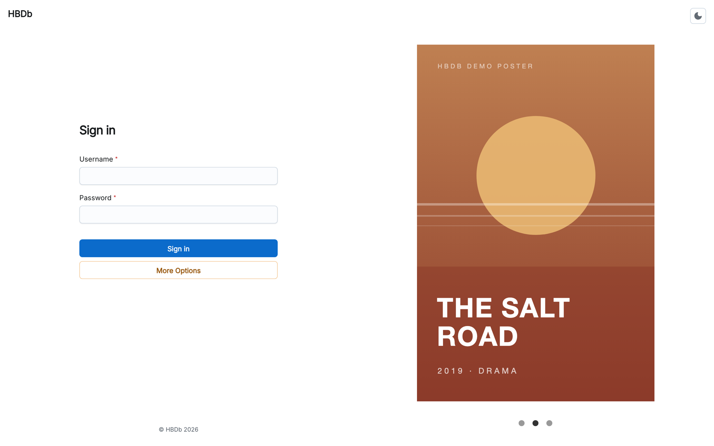
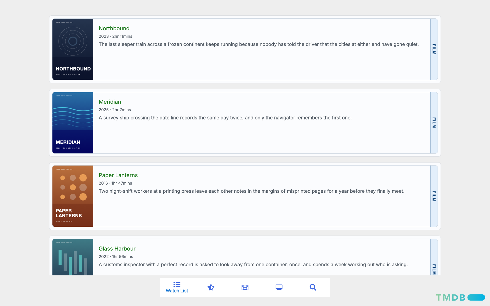
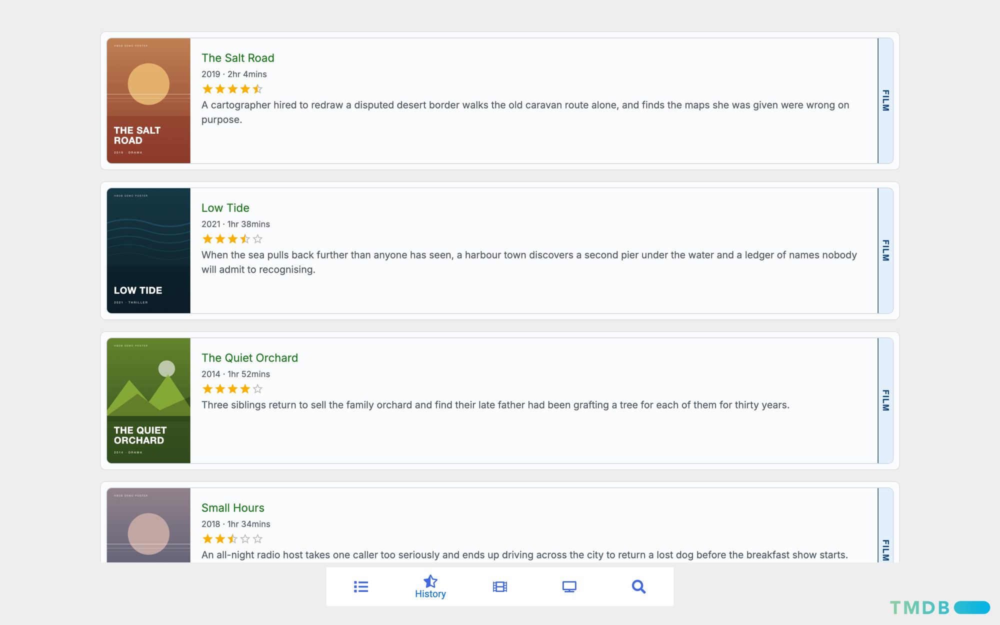

# HBDb

A personal film site for searching films, comparing their ratings, rating them yourself and keeping a watchlist.

**Status:** abandoned. Last worked on in December 2024, not deployed anywhere, kept for reference.



<sub>Screenshots use the built-in demo mode: the films and poster art are made up.</sub>

## Why it exists

Looking up a film usually means checking several sites: one for the details, others for what critics and audiences thought, and another to remember what you wanted to watch. HBDb was my attempt to put those on one page, behind a login, for me and a few people I'd give access to.

## What it does

- Searches films as you type, using [TMDB](https://www.themoviedb.org/).
- Shows a film's details with its IMDb, Letterboxd and Rotten Tomatoes ratings side by side, a trailer, and a row of similar films on flip cards.
- Lets you rate a film in half-stars and add it to or remove it from your watchlist.
- Lists your watchlist and your rated films ("History") with posters, runtimes and your ratings.
- Has a sign-in screen with request-access and password-reset forms, a light/dark toggle and an animated poster carousel.

The "Films" and "TV" tabs are placeholders; TV shows were planned but never built.

| Watch list | History |
| --- | --- |
|  |  |

## Technical highlights

- **No film database of its own.** Watchlist and ratings are stored in each user's TMDB account through TMDB's API, so the app only has to manage users.
- **The browser holds no API keys.** A small Express service ([HBDb-WS](https://github.com/BowerHarry/HBDb-WS)) signs users in against Firestore, issues session tokens, and makes every TMDB, MDBList and YouTube call itself with the signed-in user's keys. The frontend talks to it through one module, `src/api.js`.
- **Account handling on the backend.** Passwords are hashed with scrypt, and older SHA-256 hashes are upgraded the first time a user signs in. Password resets use single-use tokens that are stored hashed and expire after 24 hours.
- **Looping carousel as a custom hook.** `usePosterAnimation` gives the sign-in poster slider an endless loop by appending a copy of the first poster and jumping back with the transition switched off, and it restarts the auto-advance timer and blocks clicks while a slide is in motion.
- **Runs without a backend.** A dev-only demo mode answers the app's requests with made-up films and generated posters, and is left out of production builds.

**Stack:** React 18, Vite 5, MUI Joy and Material UI, a mix of JSX and TypeScript; Node/Express, Firestore and Nodemailer on the backend.

The original app was written in 2024. A 2026 clean-up (moving API keys and third-party calls to the backend, reworking authentication, adding demo mode) was done with an AI coding agent.

---

## For developers

### Requirements

- Node.js 18 or newer, and npm
- For anything beyond demo mode: a running copy of the [HBDb-WS](https://github.com/BowerHarry/HBDb-WS) backend with a user account. The TMDB, MDBList and YouTube API keys belong to that account and are set up there, not here.

### Run it in demo mode

Demo mode needs no backend and no API keys. It answers the app's backend requests with a dozen fictional films and generated posters, and keeps rating and watchlist changes in memory until you reload.

```bash
git clone https://github.com/BowerHarry/HBDb.git
cd HBDb
npm install
VITE_DEMO=1 npm run dev
```

Open the `http://localhost:5173` address Vite prints and sign in with any username and password. Trailers aren't shown in demo mode.

Demo mode only exists on the dev server. The code lives in `src/demo/` and is left out of production builds.

### Run it against the backend

Start HBDb-WS (it listens on port 8080 by default), then:

```bash
cp .env.example .env
npm install
npm run dev
```

`VITE_API_URL` in `.env` is the backend's address. The backend only accepts browser requests from origins in its `ALLOWED_ORIGINS` setting, which defaults to `https://localhost:5173`.

`npm run dev` serves the app over HTTPS using a locally trusted certificate from `vite-plugin-mkcert`, which may ask for your password the first time to install its certificate authority.

### Scripts

| Command | What it does |
| --- | --- |
| `npm run dev` | Start the Vite dev server, reachable on your local network |
| `npm run build` | Build to `dist/` |
| `npm run preview` | Serve the built app |
| `npm run lint` | Run ESLint on the `.js` and `.jsx` files |

### Project structure

```
index.html
src/
  main.jsx                 entry point; renders Login
  Login.tsx                sign-in screen; renders App once signed in
  App.jsx                  tab layout: Watch List, History, Films, TV, Search
  api.js                   every call to the backend
  format.js                year and runtime formatting
  hooks/usePosterAnimation.ts
  styles/login.styles.ts
  components/
    login/                 sign-in, request-access and reset-password forms, poster carousel
    search/                search bar, results, film details, similar films
    FilmCardList.jsx       card list shared by the two tabs below
    watchlist/             watchlist tab
    history/               rated films tab
    films/                 placeholder
  demo/                    demo mode: mock data, backend mocks, poster generator
  assets/                  logo images used in the UI
```

How the pieces talk to each other:

```
Browser (this repo)
  └── HBDb-WS backend
        ├── Firestore ──────── users, sessions, reset tokens
        ├── Email ──────────── access requests, password resets
        ├── TMDB API ───────── search, film details, similar films, watchlist, ratings
        ├── MDBList API ────── IMDb / Letterboxd / Rotten Tomatoes ratings
        └── YouTube Data API ─ trailer lookup
```

### Known limitations

- Not deployed, and the hosted backend is offline, so outside demo mode you need to run HBDb-WS yourself.
- The "Films" and "TV" tabs are placeholders.
- Search only returns English-language films.
- The session is kept in memory, so reloading the page signs you out, and there is no sign-out button.
- The layout is built for desktop widths.
- No automated tests, and the TypeScript files are not type-checked or linted.

### Credits

- Film data, images, watchlist and rating storage: [TMDB](https://www.themoviedb.org/). This product uses the TMDB API but is not endorsed or certified by TMDB.
- Aggregated ratings: [MDBList](https://mdblist.com/).
- Trailers: YouTube Data API.
- UI: [MUI](https://mui.com/) (Joy UI and Material UI), [react-icons](https://react-icons.github.io/react-icons/), [react-card-flip](https://github.com/AaronCCWong/react-card-flip).

### Licence

GPL-3.0. See [LICENSE](LICENSE).
